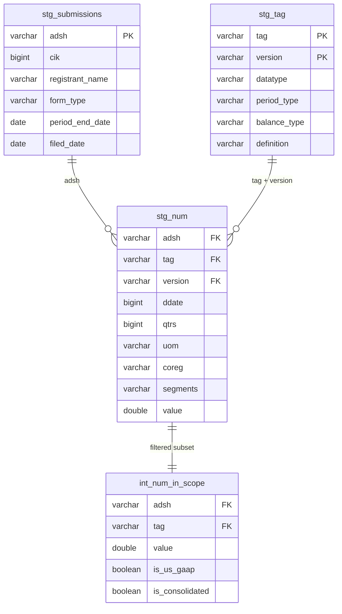
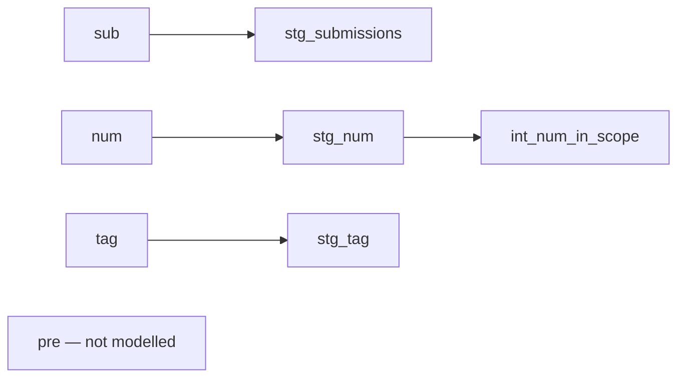

# Element Lineage and Data Model

Scope: the four dbt models and their raw sources. `pre` is ingested
but read by no model; it is out of scope here and in CDE designation.

## Purpose

This document is the map between physical column names across layers.
It serves two functions:

1. **Root cause analysis.** Data quality rules are defined on the
   final modelled layer. When a rule fails, a steward uses this table
   to trace the failing element back to the source column it came
   from and the transform applied to it.
2. **CDE inheritance.** Criticality is scored on model elements. Raw
   elements are never scored — they inherit through this table.

## Transform types

| Type | Meaning |
|---|---|
| passthrough | Same name, same value |
| renamed | Same value, new name |
| recast | Value changed type or representation |
| derived | Value computed from one or more source columns |

The type does not determine where a check runs — all checks run on the
final layer. It determines what a steward should look at first when
tracing a failure: a recast failure implicates the cast, a derived
failure implicates the expression, a passthrough failure implicates
the source.

## Entity relationships

Grain of `stg_num`: (adsh, tag, version, ddate, qtrs, uom, coreg,
segments). See F14 for why `segments` belongs in that key.

## Transformation flow

## stg_submissions

| Element | Source | Type | Note |
|---|---|---|---|
| adsh | sub.adsh | passthrough | accession number, PK |
| cik | sub.cik | passthrough | filer identifier |
| registrant_name | sub.name | renamed | |
| sic_code | sub.sic | renamed | |
| business_country | sub.countryba | renamed | |
| form_type | sub.form | renamed | |
| fiscal_year | sub.fy | renamed | |
| fiscal_period | sub.fp | renamed | |
| period_end_date | sub.period | recast | yyyymmdd integer to date (F1) |
| filed_date | sub.filed | recast | yyyymmdd integer to date (F1) |
| changed_date | sub.changed | recast | yyyymmdd integer to date (F1) |
| wksi | sub.wksi | passthrough | left integer so the {0,1} test asserts the source domain (F2) |
| prevrpt | sub.prevrpt | passthrough | as above |
| detail | sub.detail | passthrough | as above |
| quarter | ingest.py | derived | provenance, not in source |

## stg_num

| Element | Source | Type | Note |
|---|---|---|---|
| adsh | num.adsh | passthrough | FK to stg_submissions |
| tag | num.tag | passthrough | FK to stg_tag |
| version | num.version | passthrough | FK to stg_tag |
| taxonomy | num.version | derived | first segment of version |
| coreg | num.coreg | passthrough | coregistrant, null = parent |
| segments | num.segments | passthrough | null = consolidated (F14) |
| ddate | num.ddate | passthrough | yyyymmdd integer, retained |
| period_end_date | num.ddate | recast | integer to date |
| qtrs | num.qtrs | passthrough | 0 = instant, n = n quarters |
| uom | num.uom | passthrough | unit of measure |
| value | num.value | passthrough | the reported fact |
| footnote | num.footnote | passthrough | |
| is_us_gaap | num.version | derived | taxonomy = 'us-gaap' (F19) |
| is_consolidated | num.segments | derived | segments is null (F14) |
| is_parent_only | num.coreg | derived | coreg is null |
| quarter | ingest.py | derived | provenance, not in source |

## stg_tag

| Element | Source | Type | Note |
|---|---|---|---|
| tag | tag.tag | passthrough | PK part |
| version | tag.version | passthrough | PK part |
| taxonomy | tag.version | derived | first segment of version |
| is_custom | tag.custom | recast | integer to boolean |
| is_abstract | tag.abstract | recast | integer to boolean |
| datatype | tag.datatype | passthrough | |
| period_type | tag.iord | renamed | I = instant, D = duration |
| balance_type | tag.crdr | renamed | C = credit, D = debit |
| label | tag.tlabel | renamed | |
| definition | tag.doc | renamed | free-text concept definition |

## int_num_in_scope

All 16 columns are passthrough from `stg_num`. The model applies a row
filter (`is_us_gaap and is_consolidated`) and changes no column.

Scope lives here and nowhere else. Changing the governed population
means changing this WHERE clause and nothing else.

## Not modelled

`pre` (10 columns) holds statement structure — which line each tag
occupies in which financial statement. Ingested for future work on
statement-level checks. No model reads it.

22 of 36 columns in `sub` are dropped at staging: filer address,
mailing address, phone, state of incorporation, EIN, former name,
filer status, fiscal year end, accepted timestamp, instance filename,
and co-registrant CIK lists. See `docs/COLUMN_INVENTORY.md`.